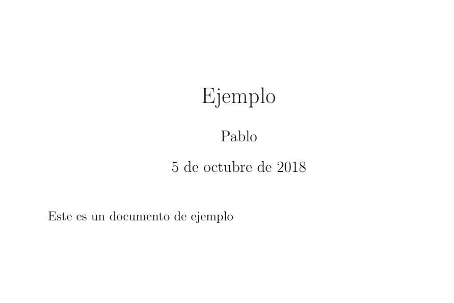
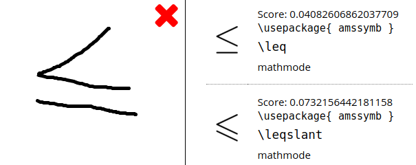

<!--Se compila con: 
pandoc -s --mathjax -t revealjs --slide-level=2 presentacion.md -o index.html 
Necesita los archivos de reveal.js
-->

<div style="font-size:1.6em">
[`mx-psi.github.io/latex`](https://mx-psi.github.io/latex)
</div>

## Instalación

<div style="font-size:1.6em">
[Post de libreim](https://libreim.github.io/blog/2015/03/14/latex)
</div>

En Ubuntu y derivados es recomendable **no** usar los paquetes de `apt`.

Instalar desde tug.org

<aside class="notes">
- Los paquetes de algunas distribuciones (en especial Ubuntu) pueden estar desactualizados y tener algunos problemas al intentar instalar paquetes. Recomendación → Instalar desde tug.org para tener la última versión. Instrucciones en: https://www.tug.org/texlive/quickinstall.html
- En caso de que no podáis instalarlo podéis usar OverLeaf
- Para editarlo: editor (emacs) o IDEish TexStudio
- Cómo se pronuncia LaTeX 
- Es un sistema de composición de textos. Se parece más a HTML (el lenguaje que describe la estructura de las páginas webs) que a Word: escribimos en un lenguaje especial que nos permite separar apariencia y estructura. Es un lenguaje Turing-completo si nos ponemos a ello.
- Es especialmente útil para escribir fórmulas matemáticas y para hacer documentos de gran longitud
- Describimos el contenido y la estructura y LaTeX se encarga de posicionar cada sección, figura...

**Qué vamos a ver**

- LaTeX es inmenso y es imposible explicarlo todo en 3 horas. Me voy a centrar en lo necesario para empezar a escribir un documento y escribir matemáticas correctamente.
- Puede haber múltiples formas de hacer algo, voy a intentar explicar la más directa.
- Yo no uso LaTeX directamente casi nunca excepto para matemáticas. Utilizo otros lenguajes de marcado más sencillos y menos tediosos de escribir que describimos después
- Vamos a ver cómo hacer pdfs con pdflatex. Pueden conseguirse otros tipos de documento (el más notable .dvi). Para compilar: `pdflatex minimal.tex`.
- A veces hay que compilar varias veces (biblatex o índice)
- Puede usarse xelatex por ejemplo.
</aside>

# Lo básico {data-background-color="#ededed"}

## Documento mínimo

<div class="twocol">
<div>
```latex
\documentclass[11pt]{scrartcl}
\usepackage[spanish]{babel}
\usepackage[utf8]{inputenc}
\usepackage[T1]{fontenc}
\usepackage{amsmath,amsfonts}

\title{Ejemplo}
\author{Pablo}

\begin{document}
\maketitle
Este es un 
documento de ejemplo
\end{document}
```
<span style="font-size:0.5em">[minimal.tex](minimal.tex)</span>
</div>
<div>
 
</div>
</div>
***

- Se escribe en documentos `.tex`.
- Escribimos el contenido y añadimos comandos cuando sea necesario.
- Los comentarios se escriben con `%`
- Compilamos con `pdflatex minimal.tex`

***

Los comandos se escriben empezando por una barra invertida (`Alt Gr` + `º`):

```latex
\comando[opcional]{arg1}{arg2}
```

***

- `\maketitle` produce el título
- `\title{Ejemplo}` indica cuál es el título
-  `\sqrt[3]{2}` produce $\sqrt[3]{2}$ (modo matemáticas)

<aside class="notes">
- `author` para autores
- `date` para la fecha
</aside>

***

- El documento se escribe después de `\begin{document}`
- **Línea en blanco** después de cada párrafo!

<aside class="notes">
Esto nos permite escribir párrafos sin que las líneas
sean kilométricas
</aside>

  
## Setup

- `documentclass` especifica el tipo de documento
- `usepackage` permite añadir paquetes
- `babel`, `inputenc`, `fontenc` para castellano
- `amsXXXX` para matemáticas

<aside class="notes">
- Otras clases: beamer, book, report, KOMA... Hay clases específicas para algunos journals por ejemplo
- Algunas opciones nos permiten modificar aspectos de la apariencia
- Instalación de paquetes en el post
- Todas las matemáticas que veamos asumen esos paquetes. Casi cualquier cosa (Anki, MathJax,...) admiten esos paquetes
- No hace falta recordarlos! Hay plantillas o podemos usar pandoc
</aside>

## Secciones

Podemos dividir el documento en secciones con `section`, `subsection`, `subsubsection`...

```latex
\section{Sección con número}
\subsection*{Subsección sin número}
```

# Matemáticas {data-background-color="#ededed"}

## Modos 

Inline
: entre `$`: $\sum_{i=1}^n \frac{i}{4}$

Display
: entre `$$` o `\[`,`\]`: $$\sum_{i=1}^n \frac{i}{4}$$

<aside class="notes">
Existen gran cantidad de símbolos. Explicamos aquí sólo los más importantes
http://www.unizar.es/analisis_matematico/cuartero/short-math-guide.pdf
Recomendación: ir aprendiendo cuando convenga
- En LaTeX es preferible `\[\]` a `$$` por el espaciado
- En otros sitios: sólo `$$`
- Los símbolos matemáticos **sólo** funcionan dentro de dólares
- Hay otros entornos que veremos a continuación
- Podemos forzar el modo display dentro de inline con `\displaystyle`
</aside>

## Símbolos comunes

Algunos símbolos se escriben directamente:

```
0123456789 . ,
+ - = ! / ( ) [ ] < > | ' :
```
Para otros símbolos necesitamos `\comandos`.

## Letras griegas

Escribimos letras griegas por su nombre en inglés:

----------- -----------
`\gamma`    $\gamma$
`\Gamma`    $\Gamma$
----------- -----------

<aside class="notes">
Versión mayúscula con la primera letra en mayúscula
</aside>


***

$\pi$ y $\sigma$ tienen versiones para sumatorio y productorio:

---------  ------------  ---------  ------------
`\Pi`       $$\Pi$$      `\prod`     $$\prod$$
`\Sigma`   $$\Sigma$$    `\sum`     $$\sum$$
---------  ------------- ----------  ------------

***

Algunas letras tienen varias versiones:

---------------   --------------
`\epsilon`        $$\epsilon$$
`\varepsilon`     $$\varepsilon$$
---------------   --------------

## Estilos de fuentes

Algunos símbolos ($\mathbb{C}$) usan una fuente especial:

---------------------  -------------------
`\mathbb{R}`           $\mathbb{R}$
`\mathcal{C}[0,1]`     $\mathcal{C}[0,1]$
`\mathfrak{h}`         $\mathfrak{h}$
`\mathsf{CRing}`         $\mathsf{Cring}$
---------------------  -------------------

## Otros símbolos

 

El resto de símbolos no siguen unas reglas concretas.
Puedes usar [Detexify](http://detexify.kirelabs.org/classify.html).

<aside class="notes">
- También hay una lista de símbolos en el post de libreim
- \varnothing vs \emptyset
- \langle y \rangle son distintos de < y >
</aside>

## Posicionado

---------------- ---------------- ------------
**Subíndices**    `a_n`            $a_n$
**Superíndices**  `e^{i\pi}`      $e^{i\pi}$
**Fracciones**    `\frac{1}{2}`   $\frac12$
---------------- ---------------- ------------

<aside class="notes">
- Hay que usar llaves cuando hay más de una cosa
- Pueden usarse overset y underset
- overbrace y underbrace
</aside>

## Paréntesis

`\left` y `\right` ajustan el tamaño de los paréntesis:

$\displaystyle f(\int_0^1 e^x \; dx)\quad$ vs. $\displaystyle \quad f\left(\int_0^1 e^x \; dx\right)$

```latex
$f(\int_0^1 e^x \; dx)$

vs.

$f\left(\int_0^1 e^x \; dx\right)$
```
<aside class="notes">
- LaTeX ignora los espacios por defecto. Hay comandos que añaden espacio:
- `\; \quad \qquad`
- Cuando hay `\left` siempre debe de haber `\right`.  Si no hay símbolo se pone `.`
- Sirve para [], (), {}, ||...
</aside>

## Operadores

¿Cómo distinguimos variables y nombres?
$lim = l \cdot i \cdot m$

---------------------  ------------------------------------  ------
`lim_{x \to 0}`        $\displaystyle lim_{x \to 0}$         :(
`\lim_{x \to 0}`       $\displaystyle \lim_{x \to 0}$        :D
---------------------  ------------------------------------  ------

. . .

En general usamos `operatorname`.

<aside class="notes">
- Babel añade acento a lím y eso
</aside>

# Formato {data-background-color="#ededed"}

## Texto

------------------------------- ---------------
`\text`**`it`**`{cursiva}`      *cursiva*
`\text`**`bf`**`{negrita}`      **negrita**
`\text`**`tt`**`{código}`       `código`
------------------------------- ---------------

<aside class="notes">
- Equivalentes para matemáticas: mathit, mathbf, mathtt
- text dentro de mates
</aside>

## Entornos

Se escriben entre `\begin{env}` y `\end{env}`

<aside class="notes">
- Indican la estructura pero no la apariencia; los ejemplos son sólo posibles formas de los mismos.
- Hay literalmente cientos, aquí veremos los más utilizados
</aside>

***

### Listas

<div class="twocol">
<div>
```latex
\begin{itemize}
\item He was a moth
\item She was a lamp
\item Can I make it 
      any more obvious?
\end{itemize}
```
</div>

<div>
- He was a moth
- She was a lamp
- Can I make it any more obvious?
</div>
</div>

## Enumeraciones

<div class="twocol">
<div>
```latex
\begin{enumerate}
\item Muchos hijos
\item un mono
\item un castillo
\end{enumerate}
```
</div>

<div>
#. Muchos hijos
#. un mono
#. un castillo
</div>
</div>

<div style="font-size:0.3em; padding-top:5em">
Véase [el documental](https://letterboxd.com/film/lots-of-kids-a-monkey-and-a-castle/)
</div>


## Descripciones

<div class="twocol">
<div>
```latex
\begin{description}
\item[Mitochondria]
     powerhouse of the cell
\item[Trebuchet]
     superior siege weapon
\end{description}
```
</div>

<div>
Mitochondria
: powerhouse of the cell

Trebuchet
: superior siege weapon
</div>
</div>

## Citas

<div class="twocol">
<div>
```latex
\begin{quote}
Kun miaj uloj 
en la restoracio Luna Rosa, 
manĝante bonegan picon 
\end{quote}
```
</div>

<div>
> Kun miaj uloj en la restoracio Luna Rosa, manĝante bonegan picon 
</div>
</div>


## En matemáticas

<div class="twocol">
<div>
```latex
\begin{equation*}
f(x) = 
\begin{cases}
0 & \text{si } 
  x \in \mathbb{Q} \\
1 & \text{si } 
  x \notin \mathbb{Q}
\end{cases}
\end{equation*}
```
</div>
<div>
$$f(x) = \begin{cases} 0 & \text{si } x \in \mathbb{Q} \\ 1 & \text{si } x \notin \mathbb{Q} \end{cases}$$
</div>
</div>

<aside class="notes">
- equation para ecuaciones numeradas (se referencian con label y ref) (equation* sin referencia)
- align para cosas alineadas
- case para casos
- matrix para matrices
- proof y theorem para 
</aside>

# Lo menos básico {data-background-color="#ededed"}

## Comandos

Podemos crear nuevos comandos:

<div class="twocol">
<div>
```
\newcommand{\der}[2]{
\frac{d#1}{d#2}
}

\[\der{f}{x}\]
```
</div>
<div>
$$\frac{df}{dx}$$
</div>
</div>

<aside class="notes">
- newcommand y renewcommand
- Cuidau con renewcommand que nos podemos estar cargando algo interno
- También podemos crear nuevos entornos, condicionales, bucles...
- LaTeX es Turing-completo
</aside>

## tikz

<div class="twocol">
<div>
```
\begin{tikzpicture}
\begin{axis}[samples=20]
\addplot3[surf,domain=-2:2]
{sin(deg(x))*cos(deg(y))};
\end{axis}
\end{tikzpicture}
```
<span style="font-size:0.5em">[standalone.tex](standalone.tex)</span>
</div>
<div>
 
</div>
</div>

<aside class="notes">
- tikz tiene muchísimas posibilidades
- Podemos hacer animaciones en presentaciones
- Como ejemplo mi presentación de mn1
</aside>

## Imágenes

Usamos `graphicx`:

<div class="twocol">
<div>
```
\usepackage{graphicx}

% ...

\includegraphics{perro}
```
</div>
<div>

</div>
</div>

## pandoc

Formato más sencillo:

<div class="twocol">
<div>
```
---
title: Ejemplo
author: Pablo
---

Este es un
documento de ejemplo.
```
<span style="font-size:0.5em">[minimal.md](minimal.md)</span>
</div>
<div>
Compilamos con:

`pandoc minimal.md`

`-o minimal.pdf`
</div>
</div>

<aside class="notes">
- obtenemos *casi* el mismo resultado.
- Permite incluir LaTeX arbitario
- org-mode también vale
- Esto está generado por pandoc
</aside>

## Leer más

LaTeX (y pandoc!) permiten muchas más cosas:

- [Código](https://en.wikibooks.org/wiki/LaTeX/Source_Code_Listings)
- [Tablas](https://en.wikibooks.org/wiki/LaTeX/Tables)
- [Bibliografía](https://en.wikibooks.org/wiki/LaTeX/Bibliography_Management)

***

Algunos recursos:


- [Plantillas de JoseAlberto444](https://gitlab.com/josealberto4444/phd-thesis)
- [Plantillas de jmml97](https://github.com/jmml97/LaTeX-Templates)
- [Plantillas de mroman42](https://github.com/mroman42/plantillas)

# Fin!


